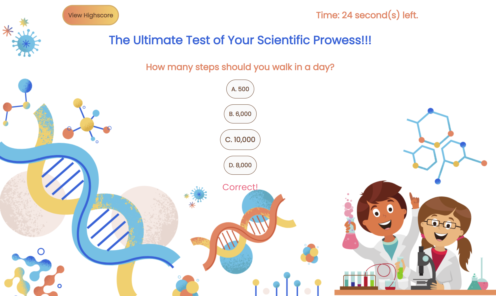

# The Science Quiz

## Table of Contents:
---

- [Description](#description)
- [Installation](#installation)
- [Usage](#usage)
- [Screenshot](#screenshot)
- [Link](#link)
- [Contact](#contact)

## Description
---
Behold, the ultimate test of your scientific prowess - the science quiz! Put on your lab coat and goggles, and prepare to be grilled with brain-busting questions that will leave you questioning your own intelligence. Get ready to laugh, cry, and maybe even scream in frustration as you attempt to answer questions about everything from quantum mechanics to the mating habits of fruit flies. So, are you ready to take the plunge into the wild and wacky world of science? Let's find out!

## Installation
---
N/A

## Usage
---

Link: https://khanhpbui.github.io/javascript-quiz/

As soon as the user lands on the page, they'll be faced with the ultimate decision - to either kick off the quiz and put their knowledge to the test, or check out the leaderboard to see how they measure up against others.   Once the quiz is underway, the timer starts ticking and questions are served up one by one for the user to tackle. But wait, there's more! A handy little comment will pop up after each answer to let the user know whether they're a genius or need to hit the books a little harder.   Beware though, every time an incorrect answer is given, 15 precious seconds will be shaved off the clock - the pressure is on! Finally, when the user completes the quiz, they can proudly save their name and score to see where they rank on the highscore list, which is proudly displayed in the browser.   Good luck!

## Screenshot
---

 

 

 

 

## Link
---
[Click Here](https://khanhpbui.github.io/my-portfolio/)

## Contact
---
If there are any questions or concerns, please contact me at: 
[GitHub](https://github.com/khanhpbui) 
[Email](mailto:pkkhanhbui@gmail.com)